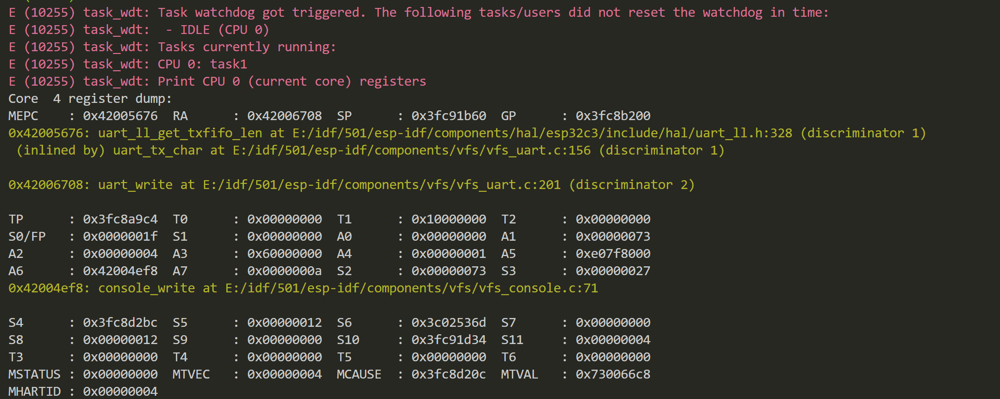

[toc] 

#### 现有的btn驱动程序为什么会存在，使用gpio_config之后就不行了的现象

#### 毛刺过滤器要使用的时钟是怎么设置的
#### gpio的中断触发方式，还有设置的初始状态，也就是gpio_config_t有什么影响
#### esp32的看门狗

上图是任务看门狗死掉了，
esp32分为任务看门狗和中断看门狗
#### 任务流程解析

IDLE：空闲任务
上面的图片就是一个时间片的解析，两个任务都处于阻塞状态的时候空闲任务就会运行

##### 非运行态之间的转化

#### uint32_t是用什么打印的？
 %u
#### 怎么使用gdb调试的功能
一首先硬件上必须要使用usb jtag，
二找到 openOCD server 要处于启动状态
三要使用以下类似的命令
riscv32-esp-elf-gdb -x gdbinit build/template-app.elf
其中gdbinit需要自己配置内容如下
target remote :3333
set remote hardware-watchpoint-limit 2
mon reset halt
maintenance flush register-cache
thb app_main
c
#### 一定要按照官网教程坚定执行
但是事实上光是按照官网上面的教程执行总是会出现各种各样的问题，首先你要准确的描述你所遇到的问题，最好能够对问题的背景有一定的了解，这样在解决这种问题的
时候就能够精准的找到类似的问题从而解决他
#### 启动systemview 
telnet localhost 4444
esp sysview start file://pro-cpu.SVDat file://app-cpu.SVDat
