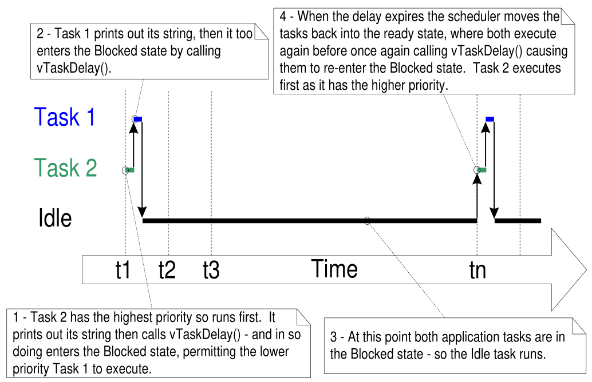

[toc] 

#### 现有的btn驱动程序为什么会存在，使用gpio_config之后就不行了的现象

#### 毛刺过滤器要使用的时钟是怎么设置的
#### gpio的中断触发方式，还有设置的初始状态，也就是gpio_config_t有什么影响
#### esp32的看门狗

上图是任务看门狗死掉了，
esp32分为任务看门狗和中断看门狗
#### 任务流程解析

IDLE：空闲任务
上面的图片就是一个时间片的解析，两个任务都处于阻塞状态的时候空闲任务就会运行

##### 非运行态之间的转化

#### uint32_t是用什么打印的？
 %u